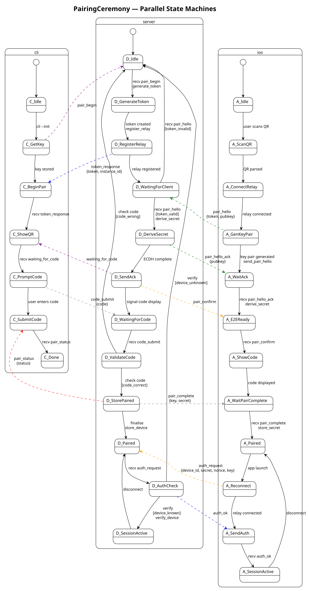

# Pigeon

Pigeon is a WebTransport relay library and server (Go + Swift + Kotlin + C + TypeScript) that enables
connections between devices where the backend sits on a private network
with no ingress. The relay forwards opaque ciphertext over QUIC — it never
sees plaintext traffic. Applications import pigeon's packages rather than
implementing relay, pairing, or crypto logic themselves.

## Trust Model

All application traffic is end-to-end encrypted:

- **Key exchange:** X25519 ECDH — each side generates an ephemeral key pair
  and derives a shared secret.
- **Symmetric encryption:** AES-256-GCM with monotonic counter nonces and
  directional key derivation via HKDF-SHA256.
- **MitM detection:** A 6-digit confirmation code derived from both public
  keys is displayed on each device. Users verify the codes match during
  the pairing ceremony.

The relay server handles only ciphertext and has no access to session keys.

## How It Works

1. A **backend** registers with the relay over a single WebTransport
   endpoint (`/pigeon`) — or raw QUIC for native clients — and is assigned
   a unique instance ID. It then parks a small pool of *listen*
   connections at the relay, each awaiting a client.
2. A **client** connects by instance ID. The relay matches it to one of
   the backend's parked listen connections and bridges the two QUIC
   connections end-to-end, so every client gets its own opaque pipe to the
   backend — reliable streams and unreliable datagrams alike.
3. Pairing and encryption happen above the relay layer, in the
   application, using pigeon's crypto and protocol packages.

## Go Library

```bash
go get github.com/marcelocantos/pigeon
```

```go
import (
    "github.com/marcelocantos/pigeon"
    "github.com/marcelocantos/pigeon/crypto"
    "github.com/marcelocantos/pigeon/protocol"
    "github.com/marcelocantos/pigeon/qr"
)
```

| Package    | Purpose                                                     |
|------------|-------------------------------------------------------------|
| root       | Client-side relay connectivity (register, connect, send/recv)|
| `crypto/`  | X25519 key exchange, AES-256-GCM channel, confirmation code |
| `protocol/`| Declarative state machine framework and pairing ceremony     |
| `qr/`      | Terminal QR code rendering and LAN IP detection              |

**Quick integration — relay + encrypted channel:**

```go
// Backend registers with the relay and waits for a paired client.
listener, instanceID, _ := pigeon.Register(ctx, &pigeon.RegisterArgs{
    Identity:  identity,                         // crypto.Identity (long-term keypair)
    Pairing:   resolvePairingRecord,             // func(clientID string) (*crypto.PairingRecord, error)
    Relay:     "https://carrier-pigeon.fly.dev",
    Token:     os.Getenv("PIGEON_TOKEN"),        // optional; wires through BearerTokenAuth
    Datagrams: map[string]uint64{"video": 1},
})
defer listener.Close()
fmt.Println("Instance ID:", instanceID) // share via QR code
session, _ := listener.Accept(ctx)     // one paired client per call
defer session.Close()

// Client connects by instance ID (obtained from QR scan).
session, _ := pigeon.Connect(ctx, &pigeon.ConnectArgs{
    InstanceID: instanceID,
    Record:     pairingRecord,                   // *crypto.PairingRecord from pairing ceremony
    Identity:   identity,
    Relay:      "https://carrier-pigeon.fly.dev",
    Datagrams:  map[string]uint64{"video": 1},
})
defer session.Close()

// Reliable stream — send/receive encrypted messages.
primary := session.Primary()
primary.Send([]byte("hello"))
data, _ := primary.Recv(ctx)

// Unreliable datagrams (latency-sensitive data, e.g. video frames).
video := session.Datagram("video")
video.Send(frame)
frame, _ = video.Recv(ctx)
```

**Encrypted channel:**

```go
// Both sides generate an ephemeral key pair and exchange public keys.
kp, _ := crypto.GenerateKeyPair()
// ... send kp.Public.Bytes() to peer; receive peerPubBytes ...
peerPub, _ := ecdh.X25519().NewPublicKey(peerPubBytes)

// Derive directional session keys and open an encrypted channel.
sendKey, _ := crypto.DeriveSessionKey(kp.Private, peerPub, []byte("client-to-server"))
recvKey, _ := crypto.DeriveSessionKey(kp.Private, peerPub, []byte("server-to-client"))
ch, _ := crypto.NewChannel(sendKey, recvKey)

// Verify the pairing is MitM-free (show 6-digit codes on both devices).
code, _ := crypto.DeriveConfirmationCode(kp.Public, peerPub)
fmt.Println("Confirmation code:", code) // e.g. "042857"

// Encrypt / decrypt messages sent through the relay.
encrypted := ch.Encrypt([]byte("hello"))
plaintext, _ := ch.Decrypt(encrypted)
```

## Swift Package

Add the GitHub repo as an SPM dependency:

```
https://github.com/marcelocantos/pigeon
```

The package provides the `Pigeon` library (iOS 16+, macOS 13+)
containing `E2ECrypto.swift` (key exchange and encrypted channel),
`PigeonRelay.swift` (relay connectivity), and the generated
`PairingCeremonyMachine.swift`.

```swift
// Both sides exchange public key bytes through the relay.
let kp = E2EKeyPair()
// ... send kp.publicKeyData; receive peerPubBytes ...
let sessionKey = try kp.deriveSessionKey(peerPublicKey: peerPubBytes,
                                         info: Data("client-to-server".utf8))
let channel = E2EChannel(sharedKey: sessionKey, isServer: false)
let encrypted = try channel.encrypt(plaintext)
let plaintext  = try channel.decrypt(ciphertext)
```

## Android/Kotlin Library

Add via [JitPack](https://jitpack.io) (Gradle):

```kotlin
// settings.gradle.kts
dependencyResolutionManagement {
    repositories {
        maven("https://jitpack.io")
    }
}

// build.gradle.kts
dependencies {
    implementation("com.github.marcelocantos.pigeon:pigeon:v0.24.0")
}
```

Requires JDK 17+ / Android API 33+ (for X25519).

```kotlin
// Key exchange
val kp = E2EKeyPair()
// ... send kp.publicKeyData (32 bytes); receive peerPubBytes ...
val sessionKey = kp.deriveSessionKey(peerPubBytes, "client-to-server".toByteArray())

// Encrypted channel from shared key
val channel = E2EChannel(sharedKey, isServer = false)
val encrypted = channel.encrypt(plaintext)
val plaintext = channel.decrypt(ciphertext)
```

## C Client Library

Pure C client library distributed as two files: `dist/pigeon.h` + `dist/pigeon.c`.
Zero heap allocations — all state lives in a `pigeon_ctx` struct sized at compile time.

```c
#include "pigeon.h"
// Compile: clang -DPIGEON_CRYPTO_LIBSODIUM $(pkg-config --cflags --libs libsodium) pigeon.c your_app.c

pigeon_ctx ctx;
pigeon_init(&ctx, &transport);  // transport = your QUIC callbacks

pigeon_keypair kp;
pigeon_generate_keypair(&kp);

pigeon_channel ch;
pigeon_channel_init_symmetric(&ch, session_key, /*is_server=*/false);
pigeon_channel_encrypt(&ch, plaintext, pt_len, out, out_len);
```

Includes generated pairing state machine, crypto (X25519 + AES-256-GCM + HKDF),
and wire framing. `PIGEON_MAX_MSG` is the sole build-time knob.

## Pairing Ceremony

The full ceremony involves three actors — **server** (backend daemon),
**mobile** (iOS client), and **CLI** (initiator):

1. CLI sends `pair_begin` to server; server generates a one-time token,
   registers with the relay, and receives an instance ID.
2. Server displays a QR code encoding the relay URL, token, and instance ID.
3. Mobile scans the QR, connects to the relay by instance ID, generates an
   X25519 key pair, and sends `{token, pubkey}` to the server through the relay.
4. Server verifies the token, performs ECDH, derives the session key, and sends
   `pair_hello_ack {pubkey}` back. Mobile performs ECDH and derives the same key.
5. Both sides independently compute the 6-digit confirmation code from the two
   public keys. The server signals CLI to show the code; mobile shows it on screen.
   The user verifies the codes match — a mismatch means a MitM is present.
6. CLI submits the code the user entered. If correct, the server sends
   `pair_complete {secret, key}` to mobile and `pair_status` to CLI. Pairing done.



## Persistent Pairing

After the first pairing ceremony, save a `PairingRecord` for reconnection
without re-scanning the QR code:

```go
// After first pairing — save this securely
record := crypto.NewPairingRecord(peerInstanceID, relayURL, myKeyPair, peerPubKey)
data, _ := record.Marshal()
os.WriteFile("pairing.json", data, 0600)

// On reconnect — load the record and connect; Connect derives the
// encrypted channel from it (the shared secret is never stored).
data, _ = os.ReadFile("pairing.json")
record, _ = crypto.UnmarshalPairingRecord(data)
session, _ := pigeon.Connect(ctx, &pigeon.ConnectArgs{
    InstanceID: record.PeerInstanceID,
    Record:     record,
    Identity:   identity,
    Relay:      record.RelayURL,
})
defer session.Close()
```

The shared secret is never stored — it is re-derived on each reconnect from
the private key and peer public key via ECDH + HKDF. `PairingRecord` is
available on all platforms: Go (`crypto.PairingRecord`), Swift
(`PairingRecord`), Kotlin (`PairingRecord`), and TypeScript
(`PairingRecord` / `createPairingRecord` / `deriveChannelFromRecord`).

For the consumer-app integration path — pairing once, persisting via a
`CredentialStore`, reconnecting through `ConnectWithArtifact`-equivalents,
and re-pairing on expiry — see the **[Pairing Artifact Lifecycle
guide](docs/pairing-lifecycle.md)**. It walks through both delivery flows
(QR scan and developer-deploy via `xcrun`) with side-by-side Go, Swift,
and Kotlin samples.

## Channels

Named reliable streams and datagram channels provide independent,
multiplexed communication paths over a session's connection.

```go
// Named reliable streams — both peers call Open/Accept with the same name
stream, _ := session.OpenStream(ctx, "game-state")
stream.Send(data)

peerStream, _ := session.AcceptStream(ctx, "game-state")
data, _ := peerStream.Recv(ctx)

// Datagram channels — pre-declared by name in RegisterArgs/ConnectArgs.Datagrams
video := session.Datagram("video")
video.Send(frame)
frame, _ := video.Recv(ctx)
```

Each named stream is its own QUIC stream on the session's connection (no
head-of-line blocking between streams). Each datagram carries the AEAD
ciphertext of `[varint channel-id][payload]` on the session's own
end-to-end connection, which the relay forwards opaquely.

## Multi-service nodes

One paired node can front several independently-addressed services over a
**single pairing** — pair once with the node, then discover and join its
services by *route*. A service is a `Session` (not a multiplex over
channels), so each gets its own connection, channels, and lifecycle.

```go
// Backend: pair once, expose routes + a discovery policy.
listener, _, _ := pigeon.Register(ctx, &pigeon.RegisterArgs{
    Identity: id, Pairing: resolve, Relay: relayURL,
    Discover: func(clientID string) ([]pigeon.RouteEntry, error) {
        return []pigeon.RouteEntry{{Route: "game-a", Metadata: []byte("Space Battle")}}, nil
    },
})
for {
    s, _ := listener.Accept(ctx)
    go dispatch(s.Route(), s) // route → service
}

// Client: enumerate, then join a service by route (over the one pairing).
ctrl, _ := pigeon.Connect(ctx, &pigeon.ConnectArgs{InstanceID: id, Record: rec, Identity: cid, Relay: relayURL})
routes, _ := ctrl.Enumerate(ctx)              // [{game-a, "Space Battle"}]
game, _ := pigeon.Connect(ctx, &pigeon.ConnectArgs{
    InstanceID: id, Record: rec, Identity: cid, Relay: relayURL, Route: "game-a",
})
```

The route rides the end-to-end activation handshake, so the relay never
learns which service a client reached; route metadata is opaque
application bytes. Design and deployment shapes (in-process dispatch vs
cascading relay): [docs/multiplexing.md](docs/multiplexing.md).

## LAN Upgrade

When both peers are on the same LAN, an established Session transparently
swaps its carrier from the relay to a direct QUIC connection. Session
identity, AEAD material, and the application API stay the same — only the
underlying transport changes (🎯T48).

```go
// Backend: start a LAN server and pass it into Register.
lan, _ := pigeon.NewLANServer("", nil) // random port, self-signed cert
defer lan.Close()

listener, instanceID, _ := pigeon.Register(ctx, &pigeon.RegisterArgs{
    Identity: identity,
    Pairing:  resolvePairingRecord,
    Relay:    relayURL,
    LAN:      lan, // advertise direct path after each Accept
})
defer listener.Close()
session, _ := listener.Accept(ctx)
// session.LANReady() closes when the client upgrades; session.UsingLAN()
// reports whether the active carrier is the direct path.

// Client: opt into LAN upgrade.
session, _ := pigeon.Connect(ctx, &pigeon.ConnectArgs{
    InstanceID: instanceID,
    Record:     pairingRecord,
    Identity:   identity,
    Relay:      relayURL,
    PreferLAN:  true, // dial NewLANServer when offered
})
defer session.Close()

// Wait (optional) for the carrier swap, then use streams as usual.
select {
case <-session.LANReady():
    // Direct path is active.
case <-ctx.Done():
}
stream, _ := session.OpenStream(ctx, "chat")
stream.Send([]byte("hello over LAN"))
```

`LANServer` is a standalone QUIC listener that can serve multiple clients.
After activation the backend opens an encrypted control stream with a
challenge; the client dials the advertised address, proves the challenge,
and both sides swap their Session transport to the verified connection.
If the dial fails (peers not co-located), the Session stays on the relay.

The relay's `--lan` flag only starts a standalone listener for local
development (port / cert-hash probing). Application backends always create
their own `NewLANServer` and pass it via `RegisterArgs.LAN`.

## Fault Injection Testing

The `faultproxy` package provides a transparent UDP proxy for testing
under adverse network conditions:

```go
proxy, _ := faultproxy.New(relayAddr,
    faultproxy.WithLatency(50*time.Millisecond, 20*time.Millisecond),
    faultproxy.WithPacketLoss(0.05),
    faultproxy.WithCorrupt(0.01),
)
defer proxy.Close()
// Connect to proxy.Addr() instead of the real relay.
```

Supports latency, jitter, packet loss, corruption, bandwidth
throttling, blackhole periods, sequence-aware drop (`WithDropAfter`,
`WithDropWindow`), and programmable per-packet hooks (`WithPacketHook`).

## Running the Relay Server

```bash
go build -o pigeon ./cmd/pigeon
PORT=443 ./pigeon                           # self-signed cert (development)
./pigeon --cert cert.pem --key key.pem      # production TLS certificate
```

The server is also deployable via Fly.io (`fly.toml` and `Dockerfile`
are included).

**Endpoints (HTTP/3 over WebTransport):**

| Route              | Description                                                  |
|--------------------|--------------------------------------------------------------|
| `GET /health`      | Health check (returns `{"status":"ok"}`)                     |
| `GET /pigeon`      | Single entry point; the role (register / listen / connect) is set by the greeting on the primary stream |

Native clients use raw QUIC (ALPN `"pigeon"`) on the QUIC port instead of
WebTransport; the same greeting selects the role.

## Configuration

| Flag / Env var | Default | Description |
|----------------|---------|-------------|
| `--port` / `PORT` | `443` | WebTransport listening port (UDP + TCP) |
| `--quic-port` / `QUIC_PORT` | `4433` | Raw QUIC listening port (native clients) |
| `--domain` | — | Domain for automatic Let's Encrypt TLS (e.g. `carrier-pigeon.fly.dev`) |
| `--acme-email` | — | Email for Let's Encrypt account |
| `--cert` | — | TLS certificate file (PEM); if `--domain` is not set |
| `--key` | — | TLS private key file (PEM); used with `--cert` |
| `--cert-validity` | `365` | Self-signed certificate validity in days (use ≤14 for WebTransport `serverCertificateHashes`) |
| `--lan` | — | Start a LAN QUIC listener at this address (dev convenience). App backends pass `NewLANServer` via `RegisterArgs.LAN` for automatic upgrade (see [LAN Upgrade](#lan-upgrade)). |
| `PIGEON_TOKEN` | — | Bearer token required for backend registration; open if unset. Wires through the default `BearerTokenAuth` verifier; replace with any custom `pigeon.Auth` for more complex admission policies. |
| `--version` | — | Print version and exit |
| `--help-agent` | — | Print usage + agent guide |

Build-time version injection: `go build -ldflags "-X main.version=v1.0.0" ./cmd/pigeon`

Max message frame size: 1 MiB (constant `maxMessageSize`).

## Running Tests

```bash
# Go — relay, crypto, protocol, and E2E integration tests
go test ./...

# Swift — crypto and state machine tests
swift test
```

## Protocol Code Generation

Protocols are defined in YAML (`protocol/pairing.yaml`) and used to
generate Go, Swift, Kotlin, C, TypeScript, TLA+, and PlantUML outputs:

```bash
go run ./cmd/protogen protocol/pairing.yaml
```

## Formal Model

A TLA+ specification (`formal/PairingCeremony.tla`) models the pairing
ceremony with an active adversary. Verified security properties include:

- No token reuse
- MitM detection via confirmation code mismatch
- Device secret secrecy
- Authentication requires completed pairing
- No nonce reuse

Run the model checker:

```bash
./formal/tlc PairingCeremony
```

## Licence

Apache 2.0 — see [LICENSE](LICENSE).
