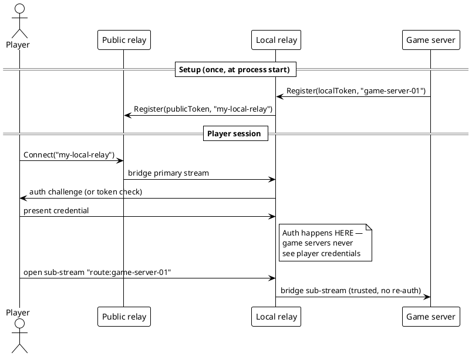

# Cascading Relay Architecture

> **Status:** Exploration / design — no code changes yet.
> **Motivation:** squz/ge (game project) needs a local development relay that
> fronts multiple game servers. Players authenticate once against the local
> relay rather than per-game-server. The local relay acts simultaneously as a
> backend (registered with the public relay) and as a relay (accepting
> registrations from game servers). This document explores what that topology
> looks like, what the current code already supports, and what would need to
> change.

---

## 1. Topology Overview

```
┌─────────────────────────────────────────────────────────────────────┐
│  Public relay  (carrier-pigeon.fly.dev)                             │
│  WebTransportServer + QUICServer + hub                              │
│  instance registry: { "abc123" → local-relay-session }             │
└───────────────────────┬─────────────────────────────────────────────┘
                        │ registered as backend (pigeon.Register)
                        │ instance ID: "abc123"
                        ▼
┌─────────────────────────────────────────────────────────────────────┐
│  Local relay  (dev machine, e.g. localhost:4433)                    │
│  Role A: backend of public relay (pigeon.Conn as registered client) │
│  Role B: relay for game servers  (WebTransportServer + hub)         │
│  instance registry: { "gs-01" → game-server-A, "gs-02" → B, … }   │
└──────────┬───────────────────────────────────────────────────────────┘
           │                          │
           │ registered as backend    │ registered as backend
           ▼                          ▼
  ┌──────────────────┐      ┌──────────────────┐
  │  Game server A   │      │  Game server B   │
  │  (pigeon.Conn)   │      │  (pigeon.Conn)   │
  └──────────────────┘      └──────────────────┘

        ▲ player connects via public relay → local relay → game server
        │
  ┌──────────────────┐
  │  Player / client │
  │  (pigeon.Connect)│
  └──────────────────┘
```

The local relay is the crux: it is simultaneously a **registered backend** of
the public relay and a **relay server** for game servers. These two roles are
independent within the Go process.

---

## 2. How the Local Relay Registers with the Public Relay

This already works with the existing API. On startup the local relay calls:

```go
conn, err := pigeon.Register(ctx, "https://carrier-pigeon.fly.dev", pigeon.Config{
    Token:      os.Getenv("PIGEON_TOKEN"),
    InstanceID: "my-local-relay",   // optional stable ID
})
```

The public relay assigns instance ID `"my-local-relay"` (or a random hex ID if
omitted). Players use `pigeon.Connect(ctx, publicRelayURL, "my-local-relay", …)`
to reach the local relay. **No public relay code changes are needed for this
step.**

---

## 3. How Game Servers Register with the Local Relay

The local relay starts its own `WebTransportServer` (and/or `QUICServer`) on a
LAN address:

```go
srv, _ := pigeon.NewWebTransportServer(":14433", tlsConfig, localToken)
go srv.ListenAndServe()
```

Game servers call:

```go
conn, _ := pigeon.Register(ctx, "https://localhost:14433", pigeon.Config{
    Token:      localToken,
    InstanceID: "game-server-01",
})
```

This is identical to how game servers would register with the public relay — no
API changes required. The local relay's hub accumulates per-game-server instance
IDs (e.g., `"game-server-01"`, `"game-server-02"`).

---

## 4. How a Player Reaches a Game Server

This is the hard part. Today the relay is a pure 1:1 bridge: one backend
instance ID, one client at a time. Extending to the cascading case requires one
of two models.

### 4a. Session Multiplexing via Sub-streams (preferred)

The player connects once to the local relay (reached via the public relay).
Over that single connection the local relay and the player speak a
**multiplexing mini-protocol** that allows the player to open named sub-channels
to individual game servers.

```
Player → public relay → local relay (primary stream, multiplexed)
                                  → game-server-01 (bridged sub-channel)
                                  → game-server-02 (bridged sub-channel)
```

Implementation sketch:

1. Player connects: `pigeon.Connect(…, "my-local-relay", …)` — establishes the
   primary `Conn`.
2. Player opens additional streams (already supported via `Conn.OpenStream()`).
   Each stream carries a small handshake identifying the target game server:
   `"route:game-server-01"`.
3. The local relay accepts those streams and bridges each one to the appropriate
   game-server instance in its hub.
4. Datagrams carry a 1-byte or 2-byte routing prefix so they can be demultiplexed
   without a new connection.

**Auth:** the player authenticates once against the local relay's token on the
primary connection. The local relay may apply its own access control before
routing to game servers. Game servers trust the local relay implicitly (they
only accept connections from it, enforced by the `PIGEON_TOKEN`).

**Lifecycle:** when the player's primary connection closes, the local relay tears
down all bridged sub-channels to game servers for that player.

### 4b. Redirect (simpler, more limited)

The local relay tells the player the direct instance ID of a game server in
the local relay's registry, and the player reconnects:

```
Player → public relay → local relay  (auth + routing decision)
Player → local relay directly        (connects to "game-server-01")
```

This requires the player to know the local relay's address directly (bypasses
the public relay for game traffic). This is fine for LAN development but breaks
the privacy/mediation goal. Not recommended for the general case.

---

## 5. Instance-ID Hierarchy

Under the multiplexing model there are two independent namespaces:

| Namespace | Relay | Example IDs |
|-----------|-------|-------------|
| Global    | Public relay | `"my-local-relay"` |
| Local     | Local relay  | `"game-server-01"`, `"game-server-02"` |

Players use the global ID to find the local relay and the local ID to name
the game server they want to reach. No hierarchical ID scheme is required
(e.g., `"my-local-relay/game-server-01"`), though one could be adopted as a
convention.

**Open question:** should the local relay expose its game-server registry to
players (so they can discover available game servers), or should game-server IDs
be pre-agreed out-of-band? A lightweight discovery endpoint (e.g., a datagram
query on the primary connection) could serve this purpose without requiring
relay-level changes.

---

## 6. Auth and Token Flow



Generate SVG: `plantuml -tsvg docs/cascading-auth.puml`

Key properties of this model:
- **Single auth boundary:** players authenticate once to the local relay.
- **Game server isolation:** game servers authenticate to the local relay, not
  to players. A compromised game server cannot impersonate the local relay to
  the public relay (different token).
- **Relay opacity:** the public relay sees only encrypted traffic between the
  player and the local relay. Game server routing is invisible to it.

---

## 7. Failure Modes and Lifecycle

| Event | Effect |
|-------|--------|
| Public relay restarts | Local relay's `Register` conn drops; it reconnects with backoff (caller's responsibility today — could be built into the library). |
| Local relay crashes | Public relay marks `"my-local-relay"` as disconnected (hub unregisters). Players get 404 on next connect. |
| Game server disconnects | Local relay's hub unregisters `"game-server-01"`. Existing routed sub-streams for that server are closed. Player gets an error on the affected sub-channel; other sub-channels are unaffected. |
| Player disconnects | Local relay tears down all bridged sub-channels for that player. |
| New game server joins | Local relay hub picks it up immediately; new sub-channel requests can route to it. No public relay interaction needed. |

---

## 8. Current Code Assessment

### What already works (no changes needed)

- **Local relay as public relay backend:** `pigeon.Register()` works as-is.
- **Local relay as relay server:** `WebTransportServer` + `QUICServer` work
  as-is; game servers register normally.
- **Single game server, single player:** the 1:1 bridge model already handles
  this as a degenerate cascading case.

### What needs to change for full multiplexing

1. **Multiplexing layer on `Conn`:** `Conn` currently bridges all streams
   between exactly two parties. For the local relay to act as a routing layer,
   it needs a way to accept streams from the player-side `Conn` and forward
   each one to a specific game-server `Conn` based on a per-stream routing
   header.

2. **Relaxed 1:1 constraint:** `handleClient` in `webtransport.go` (line 280)
   enforces `inst.occupied = true` — only one client per instance at a time.
   A multiplexing local relay (which is itself a client of the public relay)
   needs the ability to hold a single upstream slot while serving multiple
   players over sub-streams. This constraint may need to become configurable
   (e.g., a `MultiClient` flag on the instance or server).

3. **Datagram routing prefix:** datagrams today are sent without routing
   metadata. A 2-byte game-server ID prefix would allow the local relay to
   demultiplex datagrams from the player to the correct game server, and
   vice versa. Alternatively, datagrams could be restricted to a single
   selected game server per player connection.

4. **Reconnect / keep-alive helper:** the local relay's upstream connection to
   the public relay should be kept alive with automatic reconnection. This is
   today the caller's responsibility; a `pigeon.ManagedConn` or `Register`
   option would help.

5. **(Optional) Discovery protocol:** a small in-band mechanism for the player
   to list available game servers from the local relay before picking one.

---

## 9. Open Questions

1. **Multiplexing vs. redirect:** is sub-stream multiplexing worth the added
   complexity, or is it acceptable for squz/ge to connect players directly to
   the local relay (bypassing the public relay for game traffic)?

2. **Multi-player sessions:** can multiple players be routed to the same game
   server through one local relay? The current hub enforces one-client-per-
   instance. Does squz/ge need concurrent player → same game server routing,
   or is each game server session exclusive?

3. **Datagram demultiplexing:** should datagrams carry a routing prefix, or
   should each game server get a distinct datagram channel (which would require
   per-game-server QUIC connections from the local relay)?

4. **Auth credential type:** what credential does the player present to the
   local relay? Bearer token? Pigeon pairing ceremony? The current pairing
   ceremony (per `protocol/pairing.yaml`) is designed for 1:1 device pairing —
   extending it to a local relay that mediates multiple game servers may require
   a new protocol phase.

5. **TLS for local-relay ↔ game-server:** in development, self-signed certs
   with `InsecureSkipVerify` are fine. For production the local relay needs a
   certificate trusted by game servers. Should this be a shared CA, or should
   the public relay infrastructure be involved?

6. **Instance ID persistence:** if the local relay uses a stable instance ID
   (`"my-local-relay"`) it can be hard-coded into player clients. If it uses a
   random ID, players need out-of-band discovery. Stable IDs are simpler for
   development.

7. **Scope of this feature:** is this a pigeon library concern (add multiplexing
   primitives) or an application-layer concern (squz/ge builds its own routing
   on top of existing multi-stream support)? The current multi-stream API
   (`Conn.OpenStream`, `Conn.AcceptStream`) already provides the building blocks;
   the question is whether pigeon should provide a higher-level `Router` type.

---

## 10. Recommended Next Steps

In priority order:

1. **Prototype the degenerate case** in squz/ge: one local relay, one game
   server, one player. Use `pigeon.Register` + `pigeon.NewWebTransportServer`
   as-is. This validates the topology without any pigeon changes.

2. **Add a `MultiClient` option** to `WebTransportServer` (or the hub's
   instance struct) so the local relay can hold an upstream slot for multiple
   simultaneous players via sub-streams.

3. **Design the routing sub-protocol** — a minimal wire format for per-stream
   game-server selection — as a new target once squz/ge's requirements are
   clearer.

4. **Consider a `pigeon.Router` abstraction** that encapsulates the local-relay
   pattern: one upstream `Conn` (to the public relay) and many downstream
   `Conn`s (to game servers), with stream-level multiplexing. This would be a
   new target if the pattern recurs beyond squz/ge.
