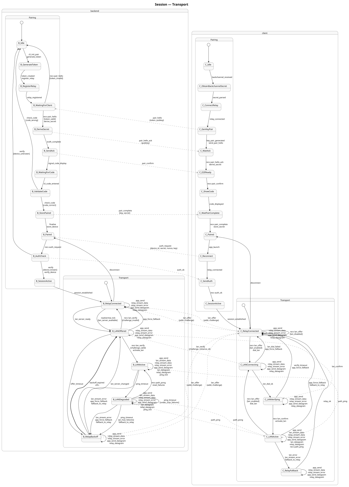
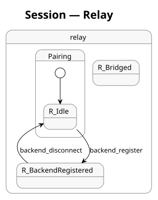

# Session Protocol

Pigeon's session protocol manages the entire lifecycle of a connection
between two devices: from initial pairing through ongoing transport
path management. It is defined as a single state machine in
[`protocol/session.yaml`](../protocol/session.yaml) and verified
by TLA+ model checking.

For the general architecture and adoption method (independent of this
protocol), see
[`formal-state-machines.md`](formal-state-machines.md).

## Overview

The protocol has two phases connected by a single choke point:

1. **Pairing** — ECDH key exchange, confirmation code verification,
   device secret establishment. One-shot: runs once per device pair.
2. **Transport** — relay (permanent baseline) + zero-or-more alternative
   candidate-pair pipes (LAN-direct as candidate kind `host`; STUN
   server-reflexive as `srflx`; future kinds plug in additively).
   Continuous: runs for the lifetime of the session, adapting to
   network conditions.

The transition between phases is `SessionActive → RelayConnected`.
For reconnection with a saved `PairingRecord`, the executor starts
directly at `RelayConnected`, skipping Phase 1.

## Actors

Three actors participate across both phases:

| Actor | Role |
|---|---|
| **backend** | The device behind the NAT/firewall. Registers with the relay, listens on its local candidate addresses, and advertises them as a set via the `candidates` control message. Includes CLI interactions (QR display, code entry) as local actions. |
| **client** | The mobile device. Scans QR, connects via relay, dials remote candidates and runs the pair-check handshake on each. |
| **relay** | The intermediary server. Bridges traffic between backend and client. Permanent baseline — never closes while the session is active. |

## State Machine Diagrams

### Transport (backend + client)



Superstates (`Connected`, `AltPath`/`AltDataPath`) are rendered as
containers. App I/O transitions inherited from superstates appear as
self-loops on the container boundary — see
[State Hierarchy](#state-hierarchy). Commands emitted by transitions
drive the executor.

### Relay



## Architecture: Machine as I/O Mediator

The state machine mediates between two event surfaces:

```
  App calls ──▶ ┌──────────┐ ──▶ Commands ──▶ I/O writes
                │  Machine  │
  I/O events ─▶ │(generated)│ ──▶ Commands ──▶ App responses
                └──────────┘
```

**Top (application):** `app_send`, `app_recv`, `app_send_datagram`,
`app_recv_datagram`, `app_close`

**Bottom (I/O):** `relay_stream_data`, `alt_stream_data`,
`relay_stream_error`, `alt_stream_error`, `relay_datagram`,
`alt_datagram`, `dial_ok`, `dial_failed`, `ping_timeout`,
`backoff_expired`

The machine is a pure function: **(State, Event) → (State, []Command)**.
The executor is a thin event loop that waits for events from both
surfaces, feeds them to the machine, and executes the returned
commands. No goroutine makes independent state decisions.

### Events

Declared in the `events:` section of session.yaml. Two categories:

- **Application events**: intent from the caller (send data, receive
  data, close connection)
- **I/O events**: completions from the runtime (data arrived on
  socket, connection error, timer expired)

Message receipts (`recv candidates`, `recv pair_check`,
`recv pair_check_ack`, `recv path_ping`, etc.) are also events —
the stream reader detects the message type and posts the
corresponding event.

`app_force_fallback` is a special application event: the caller
requests immediate fallback to relay regardless of current alt-pair
state. The machine has transitions from every alt-pair-related state,
each emitting the correct cleanup commands. This replaced an ad-hoc
`fallbackToRelay()` function that type-asserted the machine and
manipulated variables directly.

### Commands

Declared in the `commands:` section of session.yaml. The `emits:`
field on each transition lists the commands it produces. Categories:

| Category | Examples |
|---|---|
| **I/O writes** | `write_active_stream`, `send_active_datagram`, `send_path_ping` |
| **App delivery** | `deliver_recv`, `deliver_recv_datagram`, `deliver_recv_error` |
| **Resource lifecycle** | `start_alt_stream_reader`, `stop_monitor`, `close_alt_path` |
| **Timers** | `start_backoff_timer`, `start_pong_timeout`, `cancel_pong_timeout` |
| **Candidate-pair lifecycle** | `send_candidates`, `dial_candidate`, `send_pair_check`, `send_pair_check_ack` |
| **Notifications** | `signal_alt_ready`, `reset_alt_ready` |
| **Crypto** | `set_crypto_datagram` |

### Executor

The executor (`executor.go`) holds the machine, an event channel,
I/O resources, and app response channels. Its `run()` loop:

1. Wait for event from channel
2. Handle app-level events (register waiters for `app_recv`)
3. Feed event to `machine.HandleEvent(ev)` → get `[]CmdID`
4. Execute each command

I/O reader goroutines (relay stream, relay datagram, alt-pair stream,
alt-pair datagram) post events — they contain zero state logic. App
methods (`Send`, `Recv`) submit events and block on response channels.

If the machine has no transition for an event in the current state,
the event is logged and dropped. There is no fallback handler — the
machine controls all data delivery. This guarantees cross-language
behavioral consistency: if the machine doesn't handle it, it doesn't
happen.

### Boundaries

- **Encryption/decryption**: executor-level (data transform, not
  state decision). Stream reader decrypts and demuxes control
  messages before posting events.
- **Fragment reassembly**: executor-level (stateless data-plane
  logic in `processDatagram`).
- **StreamChannel I/O**: above the machine (per-stream, not routed
  through event loop).
- **DatagramChannel I/O**: through the event loop (needs demux).
- **Relay reader**: always runs (relay is permanent, control messages
  arrive on it even when an alt-pair is active).

## Phase 1: Pairing

The pairing ceremony establishes mutual trust between two devices
that have never communicated before.

### Flow

1. Backend generates a pairing token and registers with the relay
2. Token published via backchannel (QR code, NFC, Bluetooth, manual
   entry — the protocol is agnostic to the mechanism)
3. Client obtains token via backchannel, connects to relay, generates
   ECDH key pair
4. Client sends `pair_hello` with public key + token
5. Backend verifies token, derives shared secret, sends `pair_hello_ack`
6. Both sides independently compute a 6-digit confirmation code from
   the two public keys
7. User reads code from client device, enters on backend CLI
8. Backend verifies code match → stores device, sends `pair_complete`
9. Session established

### Security Properties (verified by TLA+)

- **NoTokenReuse**: revoked tokens are never accepted again
- **MitMDetectedByCodeMismatch**: if an attacker substitutes public
  keys, the confirmation codes differ — the user sees a mismatch
- **MitMPrevented**: if the shared key is compromised, pairing
  never completes
- **AuthRequiresCompletedPairing**: sessions require prior pairing
- **NoNonceReuse**: each authentication nonce accepted at most once
- **DeviceSecretSecrecy**: adversary never learns the device secret

### Adversary Model

The TLA+ spec includes a Dolev-Yao adversary with 8 specific attack
capabilities: backchannel observation, MitM key substitution, secret
re-encryption, concurrent pairing race, token brute-force, code
guessing, and session replay. All attacks are verified to be detected
or prevented by the protocol.

Method and generalisation (including privileged/internal state-tampering
adversaries): [`adversarial-modeling.md`](adversarial-modeling.md). The
current `protocol/pairing.yaml` focuses MitM on hello/welcome pubkey
substitution; the richer eight-capability catalogue is the historical
session/pairing lineage summarised above.

## Phase 2: Transport

After pairing, the transport phase manages which network path carries
traffic. The relay is always connected as a permanent baseline; in
parallel, each peer gathers transport candidates (LAN host candidates
from local interfaces today; STUN server-reflexive candidates next;
future kinds plug in without FSM changes) and runs a generic
candidate-pair handshake to nominate the best working alternative.
The application surface (L4 streams/datagrams) is routed onto the
nominated pair, with the relay always available as a zero-cost
fallback.

The transport submachine is organised as a hierarchy of superstates.
A superstate groups leaf states and defines transitions that all its
children inherit. At generation time, `FlattenedTransitions()` expands
every inherited transition onto each leaf state. Generators, TLA+, and
the runtime all consume the flattened table — the hierarchy is a YAML
authoring convenience, not a runtime concept.

### State Hierarchy

```
backend:
  Connected                        # superstate — all path states
  ├─ RelayConnected
  ├─ CandidatesAdvertised
  ├─ AltPath                       # sub-superstate — alt-pair-active states
  │   ├─ AltActive
  │   └─ AltDegraded
  └─ RelayBackoff

client:
  Connected
  ├─ RelayConnected
  ├─ PairDialing
  ├─ PairChecking
  ├─ AltDataPath                   # sub-superstate
  │   └─ AltActive
  └─ RelayBackoff
```

### Connected (superstate)

All leaf states under `Connected` inherit these data-forwarding
transitions — defined once on the superstate, not replicated per leaf:

```yaml
Connected:
  children: [RelayConnected, CandidatesAdvertised, AltPath, RelayBackoff]
  transitions:
    - {on: app_send, emits: [write_active_stream]}
    - {on: relay_stream_data, emits: [deliver_recv]}
    - {on: relay_stream_error, emits: [deliver_recv_error]}
    - {on: app_send_datagram, emits: [send_active_datagram]}
    - {on: relay_datagram, emits: [deliver_recv_datagram]}
```

This means every transport state can send and receive data — the app
never needs to know which pipe is active. The relay always delivers
(it carries control messages even when an alt-pair is active).

### AltPath / AltDataPath (sub-superstates)

States where an alt-pair pipe is usable additionally inherit
alt-pair-specific I/O:

```yaml
AltPath:
  children: [AltActive, AltDegraded]
  transitions:
    - {on: alt_stream_data, emits: [deliver_recv]}
    - {on: alt_datagram, emits: [deliver_recv_datagram]}
```

`AltActive` and `AltDegraded` thus handle both relay and alt-pair
data — inherited from two levels of the hierarchy.

### Candidate-pair establishment flow

Phase 2 generalises the original LAN-vs-relay flow into a typed
candidate model. LAN-direct is now candidate kind `host`; STUN-
reflexive (🎯T43) is `srflx`; further kinds plug in without
restructuring the FSM.

**Wire vocabulary.** Three messages over the established AEAD pipe:

| Message | Pipe | Direction | Carries |
|---|---|---|---|
| `candidates` | relay | backend → client | set of `Candidate` records + per-session pair-check challenge |
| `pair_check` | candidate pipe | client → backend | echoed challenge + instance ID |
| `pair_check_ack` | candidate pipe | backend → client | implicit pair nomination on success |

`Candidate` is a `kind / addr / priority / cand_id` record (see the
`structs:` table below). The set carried by `candidates` is what
the wire renames generalise — a flat single-address LAN offer becomes
a typed set whose first element today is always a `host` candidate.

**Flow:**

1. Backend gathers local candidates (host = local interface
   addresses; srflx = STUN-derived later). Backend listens on every
   host candidate's transport address.
2. Backend sends `candidates` over the relay pipe with the
   advertised set + a per-session pair-check challenge.
3. Client dials each remote candidate it has a route to.
4. On each successful dial, client sends `pair_check` over the
   candidate-pair pipe with the echoed challenge.
5. Backend receives `pair_check`, validates the challenge, and
   replies with `pair_check_ack` on the same pipe.
6. Receipt of `pair_check_ack` implicitly nominates that pair as
   the active alt path; both sides switch.

The activation transition (`CandidatesAdvertised → AltActive`)
explicitly emits the commands that bring up the alt-pair resources:

```yaml
emits:
  - send_pair_check_ack
  - start_alt_stream_reader
  - start_alt_dg_reader
  - start_monitor
  - signal_alt_ready
  - set_crypto_datagram
```

In the Phase 1 ship (host candidate only) the candidate set is a
single entry and nomination is trivially "the one that works." Phase
1 STUN (🎯T43) adds `srflx` candidates additively and exercises the
multi-candidate paths of this same flow.

### Health Monitor

Once an alt-pair is active, the health monitor sends `dgPing`
datagrams at fixed intervals. Each ping emits `start_pong_timeout`;
a `dgPong` reply emits `cancel_pong_timeout`. If the pong timeout
fires, `ping_timeout` triggers degradation
(`AltActive → AltDegraded`). After 3 consecutive failures, fallback:

```yaml
# AltDegraded → RelayBackoff (guard: at_max_failures)
emits:
  - stop_monitor
  - stop_alt_stream_reader
  - stop_alt_dg_reader
  - close_alt_path
  - reset_alt_ready
  - start_backoff_timer
```

Every resource start has a corresponding stop. The machine's
transition table is the single source of truth for when resources
are created and destroyed.

### Force Fallback

`app_force_fallback` is defined on every alt-pair-related leaf state,
each emitting the correct cleanup commands for that state. This
replaced ad-hoc code that type-asserted the machine and manipulated
variables directly. One `submitSync(EventAppForceFallback)` call.

### Backoff Strategy

After falling back to relay, the backend waits before re-advertising
candidates. The delay is exponential: `2^(level-1) × 1s` with ±25%
jitter, capped at level 5 (~16s). The backoff level:

- Resets to 0 on successful alt-pair establishment
- Increments on `candidates_timeout` or max-failure fallback
- Never exceeds `max_backoff_level`

### Transport Properties (verified by TLA+)

- **PathConsistency**: active path is always "relay" or "alt"
- **BackoffBounded**: backoff level never exceeds cap
- **BackoffResetsOnSuccess**: alt-pair active implies backoff = 0
- **DispatcherAlwaysBound**: dispatchers always on a valid path
- **BackendDispatcherMatchesActive**: backend dispatcher on the
  alt-pair when alt-pair is active
- **ClientDispatcherMatchesActive**: client dispatcher on the
  alt-pair when alt-pair is active
- **MonitorOnlyWhenAlt**: health monitor only pings when an
  alt-pair is active or degraded

### Leads-to Properties

- **FallbackLeadsToReadvertise**: after fallback, the backend
  eventually re-advertises candidates
- **DegradedLeadsToResolutionOrFallback**: a degraded alt-pair
  eventually either recovers or falls back

## Typed Variables

Every state variable has an explicit type (`string`, `int`, `bool`,
`set<string>`) declared in the YAML. These types are used by code
generators to emit typed structs in each target language. TLA+ ignores
types (it's untyped).

## Structs

Variables that are logically related and updated together are grouped
into structs:

| Struct | Fields | Purpose |
|---|---|---|
| `ECDHState` | backend_pub, client_pub, shared_key, code | ECDH key exchange state |
| `TokenState` | current, active, used | Pairing token lifecycle |
| `BackendPathState` | active_path, dispatcher_path, monitor_target, alt_signal | Backend transport resources |
| `ClientPathState` | active_path, dispatcher_path | Client transport resources |
| `Candidate` | kind, addr, priority, cand_id | Wire-level transport candidate descriptor (host / srflx / ...) carried in the `candidates` message |

## Code Generation

The YAML spec is the single source of truth. `protogen` generates:

| Output | What's generated |
|---|---|
| **Go** | Typed machine structs with `HandleEvent(ev) → []CmdID`. Event/command/state/message/guard/action constants. Generic `Machine` executor in `machine.go`. |
| **Swift** | Typed machines with `handleEvent(ev) → [CmdID]`. EventID/CmdID/state/message enums. Wire constants. |
| **Kotlin** | Typed machines with `handleEvent(ev) → List<CmdID>`. EventID/CmdID/state/message enums. Wire constants. |
| **TypeScript** | Typed machines with `handleEvent(ev) → CmdID[]`. EventID/CmdID/state/message enums. Wire constants. |
| **TLA+** | Pure TLA+ spec (named actions, UNCHANGED, no PlusCal). Phase-aware export. |
| **PlantUML** | Separate transport + relay diagrams. Arrow coalescing for shared qualifiers. |

All four language generators emit `handleEvent` — a unified entry
point that maps `(state, event, guards) → (new state, variable
updates, commands)`. Go additionally retains `HandleMessage`/`Step`
for backward compatibility.

All generators consume `FlattenedTransitions()` — the hierarchy is
resolved once during YAML parsing and generators see only leaf-state
transitions.

## Wire Constants

Protocol constants (datagram frame types, fragment sizes, health
thresholds, message framing, channel key derivation strings) are
declared in the `wire_constants:` section of session.yaml and
generated into all target languages:

| Language | Output |
|---|---|
| **Go** | `const` block with typed constants (`byte`, `int`, `duration_ms`, `string`) |
| **Swift** | `SessionWire` enum with static lets |
| **Kotlin** | `Wire` object with `const val`s |
| **TypeScript** | `Wire` const object |

This replaced hand-written constants that were duplicated across
languages. A frame type or timing change now requires editing one
YAML line.

## TLA+ Verification

The generated TLA+ is verified by TLC (the TLA+ model checker) in
under 1 second:

- **Transport phase**: 121 distinct states, 7 invariants, all pass
- **Pairing phase**: verified separately (with adversary model)

### Channel Elimination

The TLA+ generator uses **channel elimination**: instead of modelling
message passing as sequences (which create combinatorial state space
explosion), each receivable message type becomes a struct variable.
Senders write directly to the struct; receivers guard on it and clear
it after processing. This reduces the state space from millions to
hundreds.

---

## Appendix: The Journey

This appendix chronicles the evolution from ad-hoc implementation to
a formally verified, command-emitting state machine architecture.
It's a record of decisions, wrong turns, and the progressive
discovery that more formalism — not less — makes the system simpler.

### Starting Point: Hand-Written Everything

The pairing ceremony was the first formally modelled protocol. It was
defined in `protocol/pairing.yaml` and generated code for Go, Swift,
Kotlin, TypeScript, and TLA+. The TLA+ spec (`PairingCeremony.tla`)
was generated as PlusCal and verified with TLC. The pairing state
machine was complete and correct.

Everything after pairing — relay connection, message sending, datagram
handling — was ad-hoc Go code. No state machine, no formal model,
no verification.

### LAN Upgrade: The First Transport Feature

When LAN upgrade was added, it was implemented as a `swapTransport`
function on `Conn`. The relay connection was closed; the LAN
connection replaced it. One-shot, one direction, no going back.

This worked for the happy path but created problems:
- No fallback if LAN died
- No health monitoring
- No re-establishment after walking away and coming back

### Path Router: Keeping Both Connections

The design shifted to maintaining both the relay and LAN connections.
A `pathRouter` held a permanent relay path and an optional direct
path. Traffic routed through the best one. Fallback was automatic.

But the path router was ad-hoc Go code. It managed goroutines,
mutexes, and channel (Go channel) dispatch — none of which was
formally specified.

### The Bugs Arrive

Deterministic path-switching tests found 4 bugs:
1. `LANReady` channel not reset on re-establishment
2. Datagram dispatcher reading from dead LAN connection
3. Relay closing backend stream when client disconnected
4. Health monitor ping not failing on closed LAN server

All 4 bugs were in **resource lifecycle management** — goroutines
holding references to the wrong path, signals not reset, dispatchers
not rebound. The state machine (such as it was) described the protocol
correctly. The bugs were in the plumbing that connected the protocol
to the Go runtime.

### Insight: Resource Lifecycle Belongs in the State Machine

The key realisation: if the state machine tracked resource bindings
(which path the dispatcher reads from, which path the monitor pings,
the LANReady signal state), then every transition that changed paths
would be **forced** to update those bindings. The Go code would just
execute the state machine's instructions — no independent decisions.

New state variables were added: `b_dispatcher_path`,
`c_dispatcher_path`, `monitor_target`, `lan_signal`. The TLA+ spec
was updated. TLC verified 17 invariants including:
- `DispatcherMatchesActive`: dispatcher is on LAN when LAN is active
- `MonitorOffOnFallback`: monitor stops when falling back
- `LANSignalPendingOnFallback`: signal resets on fallback

These invariants would have caught all 4 bugs before they were written.

### Per-Actor Variables

TLC found a violation: `DispatcherMatchesActive` failed because the
backend and client switch at different times. The dispatcher path was
a single shared variable, but each actor has its own dispatcher. The
fix: split into `b_dispatcher_path` and `c_dispatcher_path`.

Similarly, `lan_signal` was shared but each `Conn` has its own
`lanReady` channel. The `LANSignalPendingOnFallback` invariant was
removed because valid states exist where actors disagree on the
signal (the backend fell back but the client hasn't processed the
change yet).

### Backoff: Formally Modelled

Exponential backoff for LAN re-advertisement was added as a state
machine concern, not an implementation detail. `backoff_level` became
a state variable. Transitions specified when to increment it (on
fallback), when to reset (on success), and the cap. TLC verified:
- `BackoffBounded`: level ≤ max
- `BackoffResetsOnSuccess`: LAN active ⟹ level = 0
- `FallbackEntersBackoff`: fallback ⟹ level ≥ 1

### Unifying Pairing and Transport

The two protocols (pairing and transport) were merged into a single
YAML (`session.yaml`). The CLI actor from the pairing spec was folded
into the backend as local actions. Actor names were unified: `server`
→ `backend`, `ios` → `client`. The transition `SessionActive →
RelayConnected` bridges the two phases.

A single YAML, one transition table, one executor per language. For
reconnection, the executor starts at `RelayConnected`, skipping
pairing.

### The PlusCal Problem

The TLA+ generator originally produced PlusCal — an imperative
language that compiles to TLA+. PlusCal was chosen by a previous
session because it looks like pseudocode and was easy to generate
mechanically.

The unified spec with PlusCal exploded to hundreds of millions of
states. TLC ran for hours and never finished. Investigation revealed:

- PlusCal introduces process interleaving (4 processes × all branches)
- Program counter variables add state dimensions
- Channel sequences create combinatorial content combinations
- The adversary's knowledge set grows with every eavesdropped message

**Archaeology of the decision**: searching the JSONL transcripts from
the jevon repo revealed that PlusCal was never a deliberate choice.
The previous session fought with PlusCal-specific issues (guard
ordering, operator placement, recv_msg scoping) for multiple
iterations — every one an artifact of PlusCal that doesn't exist in
pure TLA+.

### Rewriting the Generator: Pure TLA+

The generator was rewritten to emit pure TLA+: named actions, primed
variables, UNCHANGED. Each YAML transition maps to one TLA+ action.
No PlusCal, no processes, no program counters.

This was structurally correct but still too large — millions of states
from channel content combinations. The same 5 message types × 3 slots
× 2 channels created tens of thousands of channel state combinations.

### Phase-Aware Export

The generator learned to emit phase-specific specs: only the
transitions, variables, and properties relevant to one phase. The
adversary was restricted to the pairing phase (it has no meaningful
actions during transport). Constants were promoted for variables that
never change within a phase.

This reduced the transport spec from 21 to 12 variables and the
adversary was eliminated entirely for the transport phase.

### Channel Elimination: The Breakthrough

The final insight: channels (sequences) are the state space killer.
The hand-written `PathSwitch.tla` had 979 states because it abstracted
channels. The generated spec faithfully modelled channels and exploded.

The solution: **replace channels with struct variables.** Each
receivable message type becomes a `received_<msg>` struct variable.
Senders write directly to the struct (no Append). Receivers guard on
the struct's type field (no Head) and clear it after processing (no
Tail). No sequences anywhere.

This is semantically different from channels (it models at most one
pending message per type, not a queue). But for the protocols we
verify, this is sufficient — each message type has at most one
in-flight instance.

Result: **121 distinct states, verified in under 1 second.** Down
from hundreds of millions that never finished.

### The OnChange Mistake

With the state machine tracking resource bindings as variables, the
first attempt at wiring the generated machines into `Conn` used
`OnChange` callbacks: when a variable changed (e.g., `b_active_path`
from `"relay"` to `"lan"`), the callback inferred what to do (switch
the active path, restart the dispatcher, etc.).

This created a new class of bugs:
- Deadlocks when `OnChange` tried to lock the same mutex the machine
  was called from
- Missing inferences (stale datagrams not drained because the
  executor didn't know `b_dispatcher_path` changing implied flushing)
- The `Recv` retry hack (if the LAN stream died, Recv had ad-hoc
  logic to fall back and retry instead of letting the machine drive
  the fallback)

The fundamental problem: **the machine declared what state the system
should be in, but the executor guessed how to get there.** Variable
diffs are the wrong abstraction — each diff could imply multiple
actions, and the executor had to infer them.

### The Insight: Machine Emits Commands

The key shift: instead of the machine declaring state and the
executor inferring actions, **the machine explicitly emits commands.**
Each transition's `emits:` field lists the commands the executor
should execute. The executor doesn't infer anything — it mechanically
carries out the command list.

```yaml
- from: LANDegraded
  to: RelayBackoff
  on: ping_timeout
  guard: at_max_failures
  do: fallback_to_relay
  emits:
    - stop_monitor
    - stop_lan_stream_reader
    - stop_lan_dg_reader
    - close_lan_path
    - reset_lan_ready
    - start_backoff_timer
```

This eliminated all the OnChange inference bugs. The command list is
explicit, ordered, and complete. No guessing.

### The Event Loop

With commands explicit, the executor became a simple event loop:

1. Wait for event (from app API or I/O reader goroutine)
2. Feed to `machine.HandleEvent(event)` → get `[]CmdID`
3. Execute each command

Application methods become thin wrappers:
```go
func (c *Conn) Send(ctx context.Context, data []byte) error {
    return c.exec.send(ctx, data)
}
```

I/O reader goroutines contain zero state logic — they read bytes and
post events. The event loop is the single place where transitions
happen.

### Unified Event Space

`HandleEvent` replaced both `HandleMessage` (for received protocol
messages) and `Step` (for internal events). All inputs are events:
- `recv lan_offer` → `EventRecvLanOffer`
- `ping_timeout` → `EventPingTimeout`
- `app_send` → `EventAppSend`
- `relay_stream_data` → `EventRelayStreamData`

One method, one switch, one event space.

### Closing the Gaps: Full Machine Mediation (🎯T18)

With the executor and command emission in place, several gaps remained
where ad-hoc Go code made decisions outside the machine.

**Pong timeout lifecycle.** The executor inferred "start timer" from
`CmdSendPathPing` and "cancel timer" from `EventRecvPathPong`. This
was the same OnChange pattern in miniature — the executor guessed
what timer operations to perform. The fix: the machine explicitly
emits `start_pong_timeout` alongside `send_path_ping`, and
`cancel_pong_timeout` on pong receipt. The executor no longer
inspects event IDs to decide timer lifecycle.

**Force fallback.** `fallbackToRelay()` type-asserted the machine,
read its state, and manipulated `PingFailures` directly. Replaced
with `app_force_fallback` — a machine event with transitions from
every LAN-related state, each emitting the correct cleanup commands.
One `submitSync(EventAppForceFallback)` call.

**Unmatched event handler.** The executor's `handleUnmatchedEvent`
silently delivered data and errors regardless of machine state,
masking missing transitions. Deleted. All data and error events now
have machine transitions in every reachable transport state. If the
machine has no transition, the event is logged and dropped.

**DatagramChannel migration.** `DatagramChannel.Recv()` and `Send()`
went through legacy `Conn`-level dispatch with its own mutex,
dispatcher goroutine, and reassembler. Migrated to the executor's
event loop with per-channel datagram buffers. Removed ~200 lines of
ad-hoc dispatch code from `Conn`.

**Wire constants.** Protocol constants (frame types, fragment sizes,
health thresholds) were hardcoded in Go and hand-duplicated per
language. Moved to `wire_constants:` in session.yaml, generated into
Go/Swift/Kotlin/TypeScript. One YAML line per constant.

After these changes, the executor contains zero state logic. Every
decision flows through the machine.

### Hierarchical State Machines (🎯T19)

The transport machine's flat transition table had a scaling problem:
every path state needed identical self-loop transitions for data
forwarding (`app_send`, `relay_stream_data`, `relay_datagram`, etc.).
Five events × five leaf states = 25 transitions per actor, all
identical. Adding a new event or state required updating every
combination.

The solution: **hierarchical superstates.** The Transport section
above describes the result — `Connected` holds data-forwarding
events inherited by all path states; `LANPath`/`LANDataPath` adds
LAN-specific I/O for LAN-capable leaves. ~50 duplicated transitions
eliminated.

The framework implementation: `StateNode` with `Parent`/`Children`/
`Transitions` fields, `FlattenedTransitions()` to expand the
hierarchy, and all generators consuming the flattened table — the
hierarchy is invisible below the YAML layer.

### Generic Candidate-Pair FSM (🎯T39.7)

The LAN-vs-relay two-state path model was folded into a generic
candidate-pair sub-FSM. LAN-direct became candidate kind `host`; the
typed `Candidate` record carries `kind / addr / priority / cand_id`;
the `candidates` message carries a set; and the `pair_check` /
`pair_check_ack` handshake replaced the LAN-specific
`lan_verify` / `lan_confirm` exchange. Nomination is computed over
the candidate-pair set rather than checkpointed against a single
binary LAN-vs-relay choice. STUN-reflexive (`srflx`) candidates and
any future kind plug in additively — only the per-language gathering
code grows; the FSM, the wire shape, and the TLA+ verification are
already generic.

The historical narrative below is preserved as-is for context — its
LAN-specific framing describes the state of the project *before* the
T39.7 refactor.

### The Current State

| Layer | Formalism | Status |
|---|---|---|
| YAML spec | Single source of truth | `session.yaml` |
| Hierarchy | Superstates with inherited transitions | `Connected`, `AltPath`/`AltDataPath` |
| Events | Declared in `events:` section | App surface + I/O surface + force fallback |
| Commands | Declared in `commands:` section | I/O writes, timers, resource lifecycle, notifications |
| Emits | Per-transition command lists | Every transition declares its commands |
| Wire constants | Declared in `wire_constants:` section | Frame types, sizes, candidate kinds, thresholds — generated per language |
| Phases | Named groupings with scoped vars | Pairing (21 states, 24 vars), Transport (8 states, 20 vars) |
| Types | `string`, `int`, `bool`, `set<string>` | All variables typed |
| Structs | Named variable groups | 5 structs (ECDH, Token, BackendPath, ClientPath, Candidate) |
| Constants | Parameterised for model checking | Challenges set |
| Fairness | Per-transition weak/strong | `backoff_expired` is strong-fair |
| Properties | Invariants, liveness, leads-to | 14 total (6 security + 8 transport) |
| TLA+ generation | Pure TLA+, channel-free | ~4 k distinct states, <1s |
| Go code generation | `HandleEvent` + typed machines | Event/command/state constants |
| Other languages | `handleEvent` + typed machines | Swift, Kotlin, TypeScript |
| Executor | Thin event loop in `executor.go` | Conn delegates all I/O, zero state logic |
| PlantUML | Separate transport + relay diagrams | Arrow coalescing, hierarchy rendering |

The progression: hand-written code → hand-written TLA+ →
generated PlusCal (failed) → generated pure TLA+ (slow) → generated
pure TLA+ with channel elimination (fast) → OnChange callbacks
(wrong abstraction) → explicit command emission → close ad-hoc gaps
(🎯T18) → hierarchical superstates (🎯T19) → **generic candidate-pair
FSM (🎯T39.7).**

Each step moved more logic into the state machine and removed more
ad-hoc code from the executor. The executor now contains zero state
logic — it mechanically executes commands returned by the machine.
The hierarchy was the last structural improvement: it made the
transition table scale without duplication. The bugs that prompted
this journey are impossible by construction, and the YAML is
maintainable at scale.
